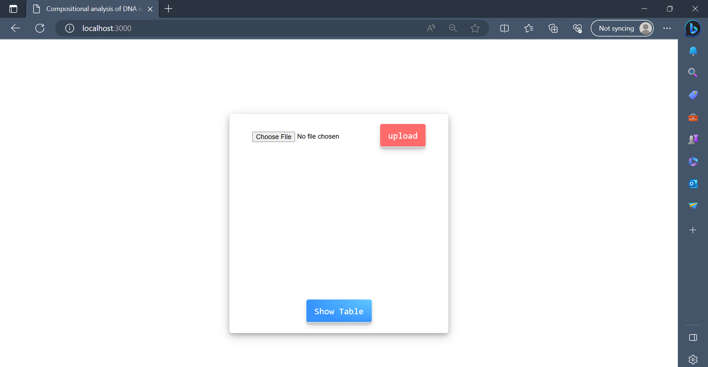
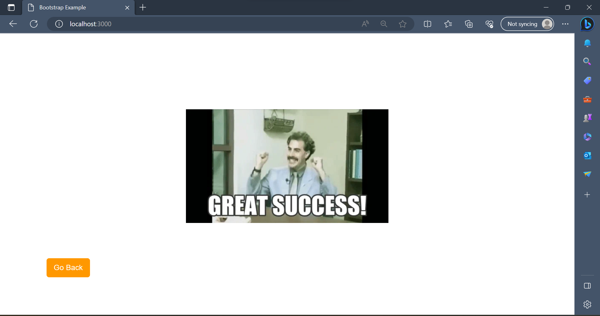
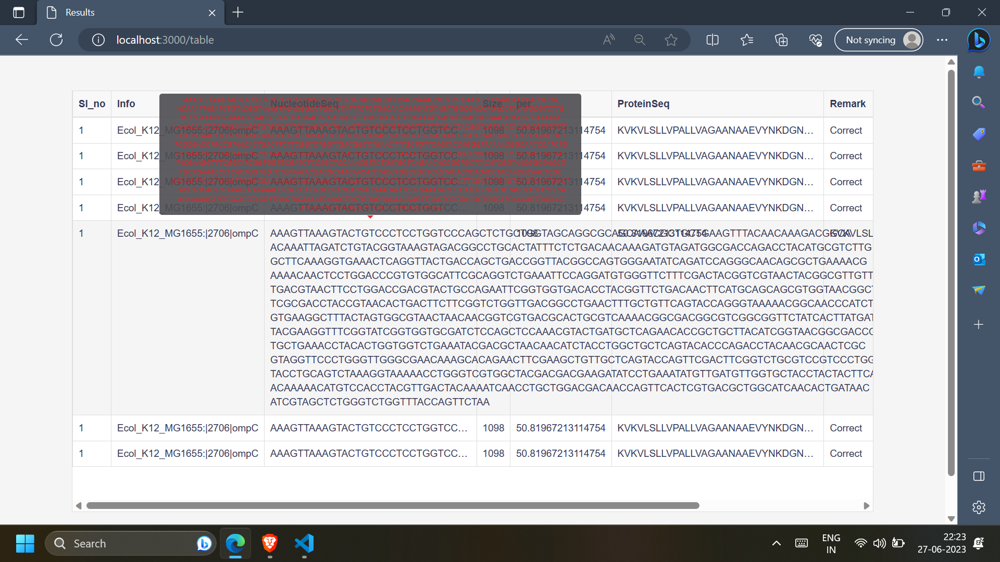

# Gene-Sequence-analysis

This is a Gene Database Application built with Node.js and MongoDB. It allows users to upload a file containing gene data, parse the data, and store it in a MongoDB database. Users can then view the gene information in a tabular format.

## Screenshots



Description: The home page of the Gene Database Application where users can upload a file containing gene data.


 

Description: Page after successful upload.



Description: The table view of the gene information after uploading a file. The genes are displayed in a tabular format with details such as sequence information, size, percentage, protein sequence, and remark.


## Features

- Upload a file containing gene data.
- Parse the data and store it in a MongoDB database.
- View gene information in a tabular format.
- Each gene entry includes details such as sequence information, size, percentage, protein sequence, and remark.

## Prerequisites

- Node.js (v12 or above)
- MongoDB (running locally or a remote server)

## Installation

1. Clone the repository:

   ```bash
   git clone <repository-url>
2. Install the dependencies:

   ```bash
   npm install

3. Configure MongoDB connection:
  Make sure MongoDB is running.
  Update the MongoDB connection URL in the app.js file:
  
    ```bash
    mongoose.connect("mongodb://<your-mongodb-url>", {
      useUnifiedTopology: true,
    });

4. Start the application:
   ```bash
   node app.js


##Usage
- Access the application in your web browser at http://localhost:3000.
- Upload a file containing gene data using the provided file upload form.
- The uploaded file will be parsed, and the gene information will be stored in the MongoDB database.
- Navigate to the "Table" page to view the gene information in a tabular format.

##Contributing
Contributions are welcome! If you find any issues or have suggestions for improvements, please open an issue or submit a pull request.


   
